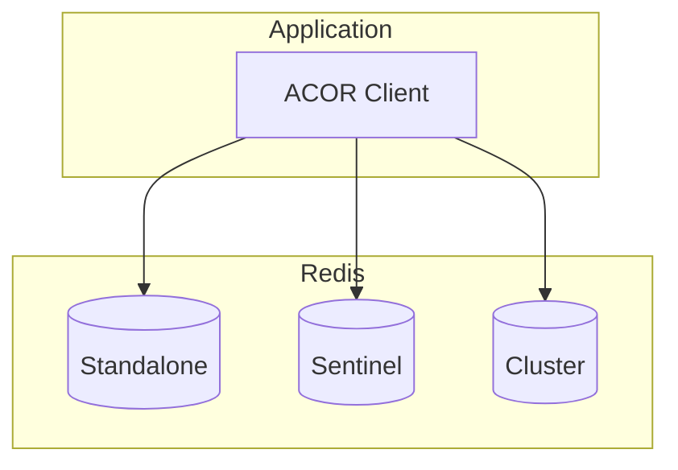

# Deployment

Guides for deploying ACOR in various environments.

## Architecture Overview



## Standalone Deployment

Simplest deployment for development or small workloads:

```go
ac, err := acor.Create(&acor.AhoCorasickArgs{
    Addr:     "redis:6379",
    Password: os.Getenv("REDIS_PASSWORD"),
    DB:       0,
    Name:     "production",
})
if err != nil {
  panic(err)
}
```

## High Availability with Sentinel

For production workloads requiring failover:

```go
ac, err := acor.Create(&acor.AhoCorasickArgs{
    Addrs: []string{
        "sentinel-1:26379",
        "sentinel-2:26379",
        "sentinel-3:26379",
    },
    MasterName: "mymaster",
    Password:   os.Getenv("REDIS_PASSWORD"),
    Name:       "production",
})
if err != nil {
    panic(err)
}
```

## Cluster Deployment

For horizontal scaling:

```go
ac, err := acor.Create(&acor.AhoCorasickArgs{
    Addrs: []string{
        "redis-node-1:7000",
        "redis-node-2:7000",
        "redis-node-3:7000",
    },
    Password: os.Getenv("REDIS_PASSWORD"),
    Name:     "production",
})
if err != nil {
    panic(err)
}
```

## Kubernetes Deployment

### ConfigMap

```yaml
apiVersion: v1
kind: ConfigMap
metadata:
  name: acor-config
data:
  REDIS_ADDR: "redis-service:6379"
  ACOR_COLLECTION: "production"
```

### Deployment

```yaml
apiVersion: apps/v1
kind: Deployment
metadata:
  name: acor-app
spec:
  replicas: 3
  selector:
    matchLabels:
      app: acor-app
  template:
    metadata:
      labels:
        app: acor-app
    spec:
      containers:
        - name: app
          image: myapp:latest
          envFrom:
            - configMapRef:
                name: acor-config
```

## Docker Compose

```yaml
version: "3.8"
services:
  redis:
    image: redis:7-alpine
    ports:
      - "6379:6379"

  app:
    build: .
    depends_on:
      - redis
    environment:
      - REDIS_ADDR=redis:6379
```

## Health Checks

The `server/health` package registers Kubernetes-compatible endpoints on an
`http.ServeMux`:

- `/healthz` — liveness; always returns `200 OK` while the process is up.
- `/readyz` — readiness; runs every registered `Checker` and returns `503` if
  any reports unhealthy.

```go
import (
    "net/http"

    "github.com/skyoo2003/acor/pkg/acor"
    "github.com/skyoo2003/acor/server/health"
)

// A readiness check implements health.Checker.
type redisChecker struct{ ac *acor.AhoCorasick }

func (c redisChecker) Check() health.CheckResult {
    if _, err := c.ac.Info(); err != nil {
        return health.CheckResult{Status: health.StatusUnhealthy, Details: err.Error()}
    }
    return health.CheckResult{Status: health.StatusHealthy}
}

checker := health.NewChecker()
checker.Register("redis", redisChecker{ac})

mux := http.NewServeMux()
health.RegisterHTTPHandlers(mux, checker) // registers /healthz and /readyz
http.ListenAndServe(":8080", mux)
```

## Best Practices

1. Use connection pooling (built-in)
2. Set appropriate timeouts
3. Monitor Redis memory usage
4. Use V2 schema for new collections
5. Implement graceful shutdown
