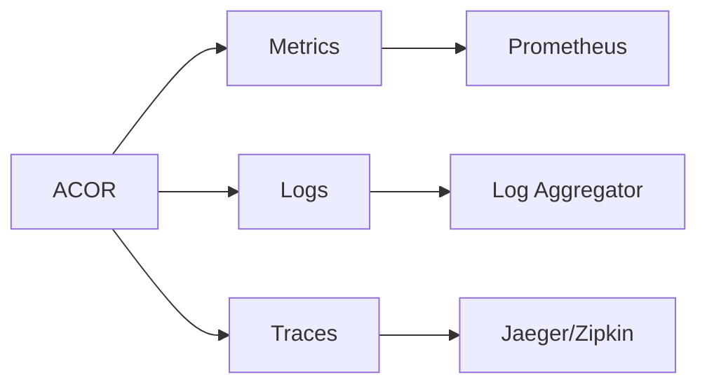

# Monitoring

Monitor ACOR performance with built-in observability support.

## Overview

ACOR provides three pillars of observability:

- **Metrics**: Prometheus-compatible metrics
- **Logging**: Structured JSON logging
- **Tracing**: OpenTelemetry distributed tracing



## Metrics

Import the metrics package:

```go
import "github.com/skyoo2003/acor/server/metrics"
```

### Available Metrics

| Metric                                  | Type      | Description                                 |
| --------------------------------------- | --------- | ------------------------------------------- |
| `acor_http_requests_total`              | Counter   | Total HTTP requests by method, path, status |
| `acor_http_request_duration_seconds`    | Histogram | HTTP request latency                        |
| `acor_grpc_requests_total`              | Counter   | Total gRPC requests by method, status       |
| `acor_grpc_request_duration_seconds`    | Histogram | gRPC request latency                        |
| `acor_redis_operations_total`           | Counter   | Total Redis operations by type, status      |
| `acor_redis_operation_duration_seconds` | Histogram | Redis operation latency                     |
| `acor_keywords_total`                   | Gauge     | Number of registered keywords               |
| `acor_trie_nodes_total`                 | Gauge     | Number of trie nodes                        |

### Exposing Metrics

```go
import (
    "net/http"

    "github.com/prometheus/client_golang/prometheus/promhttp"
    "github.com/skyoo2003/acor/server/metrics"
)

func main() {
    // nil registerer defaults to prometheus.DefaultRegisterer,
    // which is what promhttp.Handler() serves
    _ = metrics.NewRegistry(nil)

    http.Handle("/metrics", promhttp.Handler())
    http.ListenAndServe(":8080", nil)
}
```

## Logging

Import the logging package:

```go
import "github.com/skyoo2003/acor/server/logging"
```

### Structured Logging

`NewLogger` takes an `io.Writer` and a level string (`debug`, `info`, `warn`,
`error`) and returns a zerolog-based logger that always emits structured JSON.
Attach trace/span IDs with `WithTraceID`:

```go
package main

import (
    "os"

    "github.com/skyoo2003/acor/server/logging"
)

func main() {
    logger := logging.NewLogger(os.Stdout, "info")

    logger.Info().
        Str("operation", "Find").
        Int("duration_ms", 12).
        Int("matches", 5).
        Msg("operation completed")

    // traceID/spanID usually come from an OpenTelemetry span context;
    // any hex strings work here.
    traceID := "4bf92f3577b34da6a3ce929d0e0e4736"
    spanID := "00f067aa0ba902b7"
    logger.WithTraceID(traceID, spanID).Info().Msg("request handled")
}
```

### Log Levels

- `debug`: Detailed debugging info
- `info`: General operational info
- `warn`: Warning conditions
- `error`: Error conditions

## Tracing

Import the tracing package:

```go
import "github.com/skyoo2003/acor/server/tracing"
```

### OpenTelemetry Setup

```go
tracer, err := tracing.NewTracer(&tracing.Config{
    Enabled:     true,
    ServiceName: "my-service",
    Endpoint:    "localhost:4317",
    SampleRatio: 1.0,
})
if err != nil {
    // handle error
}
defer tracer.Shutdown()
```

### Spans

The core `pkg/acor` library does not emit its own spans. Request spans are
created by the `server/tracing` middleware for incoming traffic:

- HTTP requests — via `tracing.HTTPMiddleware`
- gRPC calls — via the `tracing` unary interceptor

To trace individual `Add`/`Find`/`Remove` calls, wrap them in your own spans
using the OpenTelemetry API.

## Dashboards

### Key Metrics to Monitor

1. **Operation Latency**: P50, P95, P99
2. **Error Rate**: Operations failing
3. **Keyword Count**: Collection size
4. **Redis Connections**: Pool utilization

### Grafana Dashboard

Create a Grafana dashboard using the metrics above. Key panels to include:

1. **Operation Latency**: P50/P95/P99 of `acor_redis_operation_duration_seconds`
2. **Error Rate**: Rate of `acor_redis_operations_total{status="error"}`
3. **Keyword Count**: Gauge `acor_keywords_total`
4. **Trie Nodes**: Gauge `acor_trie_nodes_total`

## Alerting Rules

```yaml
groups:
  - name: acor
    rules:
      - alert: HighLatency
        expr: histogram_quantile(0.95, rate(acor_redis_operation_duration_seconds_bucket[5m])) > 0.1
        for: 5m
        annotations:
          summary: "ACOR operations are slow"

      - alert: HighRedisErrorRate
        expr: rate(acor_redis_operations_total{status="error"}[5m]) > 0.1
        for: 5m
        annotations:
          summary: "High Redis error rate"
```
