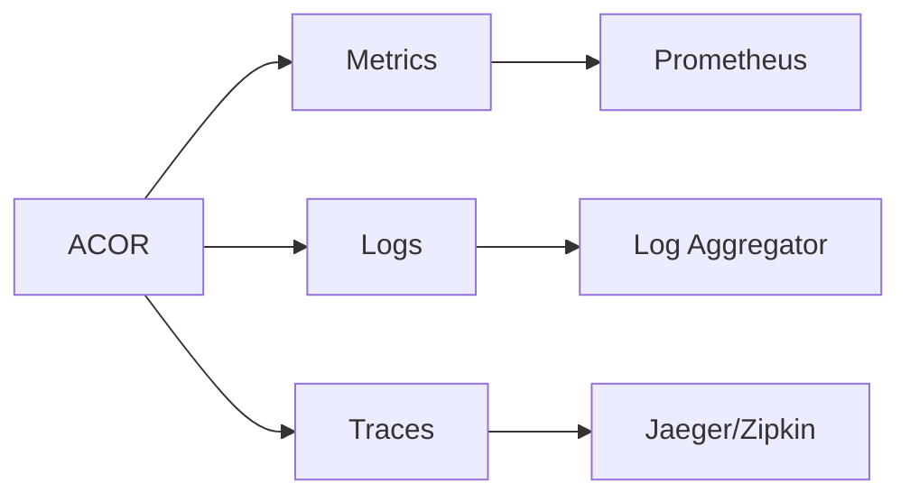

# Monitoring

Monitor ACOR performance with built-in observability support.

## Overview

ACOR provides three pillars of observability:

- **Metrics**: Prometheus-compatible metrics
- **Logging**: Structured JSON logging
- **Tracing**: OpenTelemetry distributed tracing



## Metrics

Import the metrics package:

```go
import "github.com/skyoo2003/acor/pkg/metrics"
```

### Available Metrics

| Metric | Type | Description |
|--------|------|-------------|
| `acor_operations_total` | Counter | Total operations by type |
| `acor_operation_duration` | Histogram | Operation latency |
| `acor_keywords_count` | Gauge | Active keywords |
| `acor_redis_errors` | Counter | Redis errors by type |

### Exposing Metrics

```go
import (
    "github.com/prometheus/client_golang/prometheus/promhttp"
    "github.com/skyoo2003/acor/pkg/metrics"
)

func main() {
    ac, _ := acor.Create(&acor.AhoCorasickArgs{...})
    
    metrics.Register(ac)
    
    http.Handle("/metrics", promhttp.Handler())
    http.ListenAndServe(":8080", nil)
}
```

## Logging

Import the logging package:

```go
import "github.com/skyoo2003/acor/pkg/logging"
```

### Structured Logging

```go
logger := logging.NewLogger(logging.Config{
    Level:  "info",
    Format: "json",
})

logger.Info("operation completed",
    "operation", "Find",
    "duration_ms", 12,
    "matches", 5,
)
```

### Log Levels

- `debug`: Detailed debugging info
- `info`: General operational info
- `warn`: Warning conditions
- `error`: Error conditions

## Tracing

Import the tracing package:

```go
import "github.com/skyoo2003/acor/pkg/tracing"
```

### OpenTelemetry Setup

```go
tp, _ := tracing.NewTracerProvider(tracing.Config{
    ServiceName: "my-service",
    Endpoint:    "localhost:4317",
})
defer tp.Shutdown(context.Background())
```

### Spans

ACOR automatically creates spans for:

- `acor.Add`
- `acor.Find`
- `acor.Remove`
- Redis operations

## Dashboards

### Key Metrics to Monitor

1. **Operation Latency**: P50, P95, P99
2. **Error Rate**: Operations failing
3. **Keyword Count**: Collection size
4. **Redis Connections**: Pool utilization

### Grafana Dashboard

Import the provided dashboard JSON from `contrib/dashboards/acor.json`.

## Alerting Rules

```yaml
groups:
- name: acor
  rules:
  - alert: HighLatency
    expr: histogram_quantile(0.95, acor_operation_duration) > 0.1
    for: 5m
    annotations:
      summary: "ACOR operations are slow"
  
  - alert: HighErrorRate
    expr: rate(acor_redis_errors[5m]) > 0.1
    for: 5m
    annotations:
      summary: "High Redis error rate"
```
