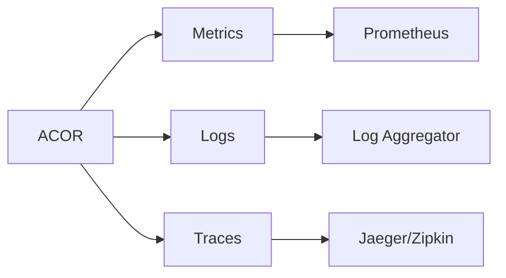

# Monitoring

Monitor ACOR performance with built-in observability support.

> **The `server/*` packages on this page are experimental.** They live in the
> separate `github.com/skyoo2003/acor/server` module, which publishes no version
> tags of its own and is **not covered by the core module's compatibility
> promise** — its API can change in any release. The core library (`pkg/acor`) is
> unaffected.
>
> `go get github.com/skyoo2003/acor/server` resolves a pseudo-version from `main`.
> Pin the core module explicitly in the same `go.mod`: Go ignores a dependency's
> own `replace` directive, so without a pin you get whichever core version the
> server module's `require` names.

## Overview

Two layers, and which one you get depends on how you run ACOR:

| Layer | What it gives you | Covered by the `v1` promise |
| ----- | ----------------- | --------------------------- |
| `pkg/acor` — the library | `CacheStats()`: cache hit rate, rebuild cost, invalidation lag | ✅ |
| `acor/server` — the service | Prometheus metrics, structured JSON logs, OpenTelemetry traces | ❌ experimental |

Embedding the library gets you the first row only. Everything after the next section is
`server/*`, which means importing a separate, experimental module — reach for it when
you run ACOR as a service, not to instrument your own process.

## Core library: cache statistics

`CacheStats()` answers the three questions that decide whether ACOR is behaving: how
often reads avoid Redis, how much a peer's write costs every reader, and how fast
invalidations propagate. It does no Redis I/O, so scraping it on a timer is cheap.

<!-- doccheck -->
```go
stats := ac.CacheStats()

// Hits+Misses is the read count. Both are zero before the first read.
hitRate := 0.0
if reads := stats.Hits + stats.Misses; reads > 0 {
    hitRate = float64(stats.Hits) / float64(reads)
}

// What one rebuild costs — the price a write makes every reader pay.
meanRebuild := time.Duration(0)
if stats.Rebuilds > 0 {
    meanRebuild = stats.RebuildDuration / time.Duration(stats.Rebuilds)
}

lag := stats.LastInvalidationLag
_, _, _ = hitRate, meanRebuild, lag
```

Wire those three into whatever you already run — a Prometheus collector, an OTel
meter, a log line. ACOR deliberately depends on no metrics library, so the choice
stays yours.

### Reading the numbers

- **The counters are per instance and per process.** Nothing is aggregated through
  Redis, so in a fleet you scrape every instance. A restart resets them.
- **`Rebuilds` will not equal `Misses`.** Concurrent misses coalesce onto one build, so
  `Misses - Rebuilds` is what that coalescing saved; local writes rebuild off the read
  path and push the count the other way. In `Preset` mode `Rebuilds` starts at 1, from
  the build during `Create`. Both counters are `uint64`, so check `Misses > Rebuilds`
  before subtracting — a write-heavy instance is routinely the other way round, and the
  difference wraps to roughly 1.8e19 rather than going negative.
- **One scanning call is one read, whatever it scans over.** `FindParallel`,
  `FindIndexParallel`, and `FindMany` load the automaton once per call and scan every
  chunk or text against that snapshot, so each adds 1 to `Hits`+`Misses` and their hit
  rate is directly comparable to a serial workload's. Calls that never reach the
  automaton — writes, `Suggest`, `Info` — add nothing to either counter.
- **`LastInvalidationLag` needs a listener, and carries clock skew.** It is populated
  only in `Preset` mode and in V2 with `EnableCache`; the other modes subscribe to
  nothing, so a zero there means unavailable, not fast. Where it is populated, the
  publish timestamp comes from another machine's clock, so the value is the real delay
  plus that clock's offset — it can understate the delay as readily as overstate it, and
  bounds it in neither direction. Watch it for step changes rather than trusting the
  absolute value, and check NTP before concluding Pub/Sub is slow.
- **A zero hit rate is not always a bug.** Without `Preset` or `EnableCache` every read
  still checks Redis for freshness; a hit there means only that the automaton was
  reused, not that the round trip was skipped.
- **What is not here**: match counts, keyword counts, and Redis latency. Keyword and
  node counts come from `Info()`, which does read Redis.

## Service layer: `server/*`


```mermaid
graph LR
    A[ACOR] --> B[Metrics]
    A --> C[Logs]
    A --> D[Traces]

    B --> E[Prometheus]
    C --> F[Log Aggregator]
    D --> G[Jaeger/Zipkin]
```

### Metrics

Import the metrics package:

```go
import "github.com/skyoo2003/acor/server/metrics"
```

#### Available Metrics

| Metric                                  | Type      | Description                                 |
| --------------------------------------- | --------- | ------------------------------------------- |
| `acor_http_requests_total`              | Counter   | Total HTTP requests by method, path, status |
| `acor_http_request_duration_seconds`    | Histogram | HTTP request latency                        |
| `acor_redis_operations_total`           | Counter   | Total Redis operations by type, status      |
| `acor_redis_operation_duration_seconds` | Histogram | Redis operation latency                     |
| `acor_keywords_total`                   | Gauge     | Number of registered keywords               |
| `acor_trie_nodes_total`                 | Gauge     | Number of trie nodes                        |
| `grpc_server_handled_total`             | Counter   | Total gRPC requests by method, code         |
| `grpc_server_handling_seconds`          | Histogram | gRPC request latency                        |

gRPC metrics use the standard `grpc_server_*` names from
`go-grpc-middleware/providers/prometheus`, wired via
`NewGRPCServerWithObservability`.

#### Exposing Metrics

```go
import (
    "net/http"

    "github.com/prometheus/client_golang/prometheus/promhttp"
    "github.com/skyoo2003/acor/server/metrics"
)

func main() {
    // nil registerer defaults to prometheus.DefaultRegisterer,
    // which is what promhttp.Handler() serves
    _ = metrics.NewRegistry(nil)

    http.Handle("/metrics", promhttp.Handler())
    http.ListenAndServe(":8080", nil)
}
```

### Logging

Import the logging package:

```go
import "github.com/skyoo2003/acor/server/logging"
```

#### Structured Logging

`NewLogger` takes an `io.Writer` and a level string (`debug`, `info`, `warn`,
`error`) and returns a zerolog-based logger that always emits structured JSON.
Attach trace/span IDs with `WithTraceID`:

<!-- doccheck:server -->
```go
package main

import (
    "os"

    "github.com/skyoo2003/acor/server/logging"
)

func main() {
    logger := logging.NewLogger(os.Stdout, "info")

    logger.Info().
        Str("operation", "Find").
        Int("duration_ms", 12).
        Int("matches", 5).
        Msg("operation completed")

    // traceID/spanID usually come from an OpenTelemetry span context;
    // any hex strings work here.
    traceID := "4bf92f3577b34da6a3ce929d0e0e4736"
    spanID := "00f067aa0ba902b7"
    logger.WithTraceID(traceID, spanID).Info().Msg("request handled")
}
```

#### Log Levels

- `debug`: Detailed debugging info
- `info`: General operational info
- `warn`: Warning conditions
- `error`: Error conditions

### Tracing

Import the tracing package:

```go
import "github.com/skyoo2003/acor/server/tracing"
```

#### OpenTelemetry Setup

<!-- doccheck:server -->
```go
tracer, err := tracing.NewTracer(&tracing.Config{
    Enabled:     true,
    ServiceName: "my-service",
    Endpoint:    "localhost:4317",
    SampleRatio: 1.0,
})
if err != nil {
    // handle error
}
defer tracer.Shutdown()
```

#### Spans

The core `pkg/acor` library does not emit its own spans. Request spans are
created by the `server/tracing` middleware for incoming traffic:

- HTTP requests — via `tracing.HTTPMiddleware`
- gRPC calls — via the standard `otelgrpc` stats handler (`tracing.GRPCStatsHandler`)

To trace individual `Add`/`Find`/`Remove` calls, wrap them in your own spans
using the OpenTelemetry API.

### Dashboards

#### Key Metrics to Monitor

1. **Operation Latency**: P50, P95, P99
2. **Error Rate**: Operations failing
3. **Keyword Count**: Collection size
4. **Redis Connections**: Pool utilization

#### Grafana Dashboard

Create a Grafana dashboard using the metrics above. Key panels to include:

1. **Operation Latency**: P50/P95/P99 of `acor_redis_operation_duration_seconds`
2. **Error Rate**: Rate of `acor_redis_operations_total{status="error"}`
3. **Keyword Count**: Gauge `acor_keywords_total`
4. **Trie Nodes**: Gauge `acor_trie_nodes_total`

### Alerting Rules

```yaml
groups:
  - name: acor
    rules:
      - alert: HighLatency
        expr: histogram_quantile(0.95, rate(acor_redis_operation_duration_seconds_bucket[5m])) > 0.1
        for: 5m
        annotations:
          summary: "ACOR operations are slow"

      - alert: HighRedisErrorRate
        expr: rate(acor_redis_operations_total{status="error"}[5m]) > 0.1
        for: 5m
        annotations:
          summary: "High Redis error rate"
```
