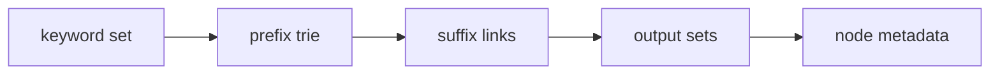

# Schema V1 (Legacy)

V1 is the original ACOR storage schema. It uses multiple Redis keys per collection.

## Overview

V1 creates approximately 5 keys per 100 keywords:

| Key Pattern | Purpose |
|-------------|---------|
| `{name}:keyword` | Sorted set of keywords |
| `{name}:prefix` | Trie prefix edges |
| `{name}:suffix` | Trie suffix links |
| `{name}:output:{state}` | Output keywords per state |
| `{name}:node:{keyword}` | Node metadata |

## Performance Characteristics

| Operation | Complexity |
|-----------|------------|
| Find() | O(N×3-5) RTT |
| Add() | O(M×3-10) RTT |

Where:
- N = number of trie states visited
- M = keyword length

## When to Use V1

- Existing collections using V1
- Small keyword sets (< 10,000)
- Migration not feasible

## Migration to V2

```bash
# Preview migration
acor -name mycollection migrate --dry-run

# Execute migration
acor -name mycollection migrate

# Rollback to V1
acor -name mycollection migrate-rollback
```

## Key Structure Diagram



## Limitations

- Higher memory usage
- More Redis keys to manage
- Slower Find() operations
- More network round-trips

## Recommendation

**Migrate to V2** for new collections or when performance is critical.
