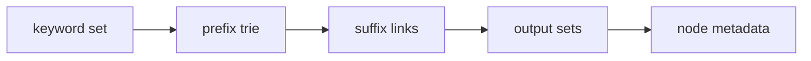

# Schema V1 (Deprecated)

V1 is the original ACOR storage schema. It uses multiple Redis keys per collection.

> **V1 is deprecated and read-only as of `v1.5.0`.** Reads, `Suggest`, and `Info` work,
> and `MigrateV1ToV2` converts a collection in place, but `Add` and `Remove` return
> `ErrV1ReadOnly`. `Flush` also still works, and still deletes every key in the
> collection — read-only refuses keyword writes, it does not protect the collection from
> `Flush`. It gains no features either: preset engines and
> `EnableCache` both require V2. New collections should use the default V2 schema.
> The read path stays for the whole `v1` line and is removed no earlier than `v2`.

## Overview

V1 creates approximately 5 keys per 100 keywords:

| Key Pattern | Purpose |
|-------------|---------|
| `{name}:keyword` | Set of keywords |
| `{name}:prefix` | Trie prefix edges |
| `{name}:suffix` | Trie suffix links |
| `{name}:output:{state}` | Output keywords per state |
| `{name}:node:{keyword}` | Node metadata |

## Performance Characteristics

| Operation | Complexity |
|-----------|------------|
| Find() | O(N×3-5) RTT |
| Add() | O(M×3-10) RTT — no longer reachable; kept to explain the migration's value |

Where:
- N = number of trie states visited
- M = keyword length

## When to Use V1

- Existing collections using V1
- Small keyword sets (< 10,000)
- Migration not feasible

## Migration to V2

```bash
# Preview migration
acor -name mycollection migrate --dry-run

# Execute migration
acor -name mycollection migrate

# Rollback to V1
acor -name mycollection migrate-rollback
```

## Key Structure Diagram


```mermaid
graph LR
    A[keyword set] --> B[prefix trie]
    B --> C[suffix links]
    C --> D[output sets]
    D --> E[node metadata]
```

## Limitations

- Higher memory usage
- More Redis keys to manage
- Slower Find() operations
- More network round-trips

## Recommendation

**Migrate to V2** for new collections or when performance is critical.
