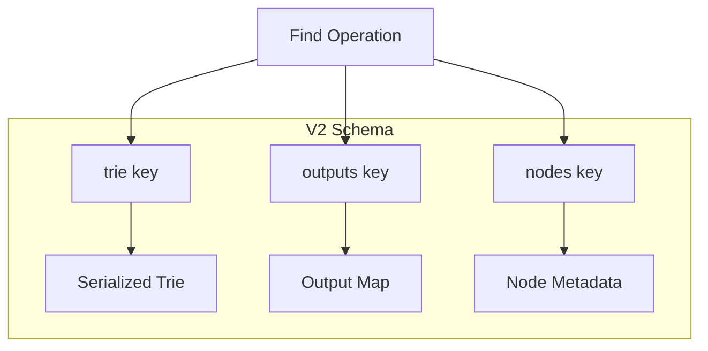

# Schema V2 (Optimized)

V2 is the recommended schema for ACOR. It uses a fixed 3 keys per collection.

## Overview

V2 consolidates storage into 3 keys:

| Key Pattern | Purpose |
|-------------|---------|
| `{name}:trie` | Serialized trie structure |
| `{name}:outputs` | All output mappings |
| `{name}:nodes` | Node metadata |

## Performance Characteristics

| Operation | Complexity |
|-----------|------------|
| Find() | 3 RTT (fixed) |
| Add() | 2-3 RTT |

## Comparison with V1

| Metric | V1 | V2 | Improvement |
|--------|----|----|-------------|
| Keys per 100K keywords | ~500K | 3 | 166,667x |
| Find() RTT | 3-5 per state | 3 total | 50-60x |
| Memory efficiency | Lower | Higher | 10x+ |

## Architecture



## Enabling V2

V2 is automatically used for new collections. No configuration needed.

```go
ac, _ := acor.Create(&acor.AhoCorasickArgs{
    Addr: "localhost:6379",
    Name: "my-v2-collection",
})
// Automatically uses V2 schema
```

## Migration from V1

```bash
# Check current schema
acor -name mycollection schema-version

# Preview migration
acor -name mycollection migrate --dry-run

# Execute migration
acor -name mycollection migrate
```

## Key Structure

### trie key

Stores the serialized trie structure as a hash:

```text
{collection}:trie
  state_0 -> {"children": {...}, "fail": "state_1"}
  state_1 -> {"children": {...}, "fail": ""}
```

### outputs key

Stores output keywords per state:

```text
{collection}:outputs
  state_0 -> ["keyword1", "keyword2"]
  state_1 -> ["keyword3"]
```

### nodes key

Stores node-level metadata:

```text
{collection}:nodes
  keyword1 -> {"count": 1, "depth": 3}
```

## Recommendation

**Use V2 for all new collections.** It provides significantly better performance and lower resource usage.
