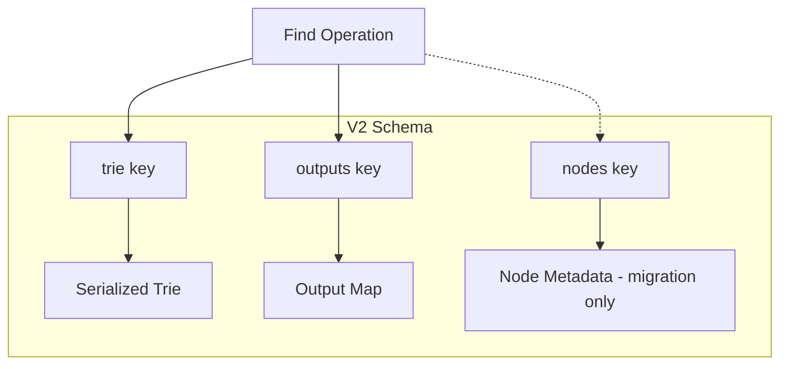

# Schema V2 (Optimized)

V2 is the recommended schema for ACOR. It uses a fixed 3 keys per collection.

## Overview

V2 consolidates storage into 3 keys:

| Key Pattern | Purpose |
|-------------|---------|
| `{name}:trie` | Serialized trie structure (keywords, prefixes, version) |
| `{name}:outputs` | All output mappings (state -> keywords) |
| `{name}:nodes` | Node metadata (migration only, cleaned up by flush) |

## Performance Characteristics

| Operation | Complexity |
|-----------|------------|
| Find() | 1 RTT (fixed), 0 RTT with EnableCache |
| Add() | 2 RTT (flat, independent of keyword length) |

## Comparison with V1

Round trips are counted by tests on every CI run; timings are a sample from the
hardware named on the [benchmarks page](../benchmarks/).

| Metric | V1 | V2 |
|--------|----|----|
| Keys per 100K keywords | ~500K | 3 |
| `Find()` round trips | 1 | 1 |
| `Add()` round trips | grows with keyword length (53 at 5 chars, 507 at 26) | 2 |
| `Add()` time | baseline | ~14x faster |
| `Find()` time, no cache | baseline | ~1.7x **slower** at 1000 keywords |

V2's win is on writes, not reads. Both schemas read in a single round trip, and
uncached V2 is slightly slower on `Find()` because it reads an outputs hash with
one entry per trie state where V1 reads only the keyword set. The large read
speedups belong to `EnableCache` and the preset engines, not to the schema. See
[Benchmarks](../benchmarks/) for the full tables and how to reproduce them.

## Architecture


```mermaid
graph TB
    subgraph V2 Schema
        A[trie key] --> B[Serialized Trie]
        C[outputs key] --> D[Output Map]
        E[nodes key] --> F[Node Metadata - migration only]
    end

    G[Find Operation] --> A
    G --> C
    G -.-> E
```

## Enabling V2

V2 is automatically used for new collections. No configuration needed.

```go
ac, err := acor.Create(&acor.AhoCorasickArgs{
    Addr: "localhost:6379",
    Name: "my-v2-collection",
})
if err != nil {
    log.Fatal(err)
}
// Automatically uses V2 schema
```

## Migration from V1

```bash
# Check current schema
acor -name mycollection schema-version

# Preview migration
acor -name mycollection migrate --dry-run

# Execute migration
acor -name mycollection migrate
```

## Key Structure

### trie key

Stores the serialized trie as a hash with three fields:

```text
{collection}:trie
  keywords -> ["keyword1", "keyword2", ...]
  prefixes  -> ["", "h", "he", ...]
  version   -> <int64 optimistic lock>
```

Collections written before v0.11 also carry a `suffixes` field. It is never
read, is left alone by writes, and is dropped by the next `Flush()`.

### outputs key

Stores output keywords per trie state as a hash:

```text
{collection}:outputs
  he  -> ["he"]
  she -> ["he", "she"]
```

### nodes key

A hash mapping each keyword to a JSON array of its trie state strings. It is
populated only by V1→V2 migration (fresh V2 collections do not write it):

```text
{collection}:nodes  (hash)
  keyword1 -> ["s0","s1","s2"]
```

## Recommendation

**Use V2 for all new collections.** It provides significantly better performance and lower resource usage.
